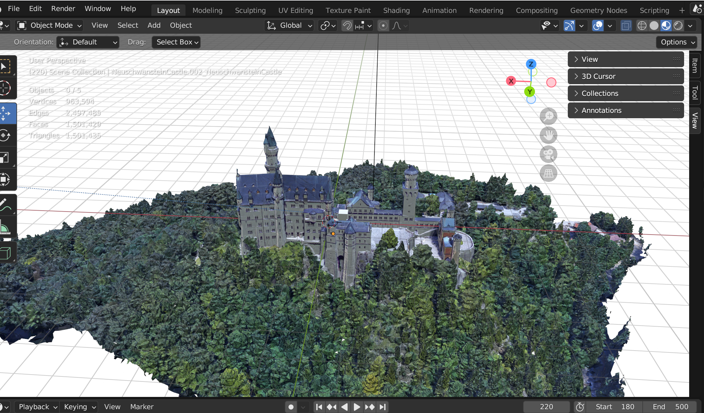
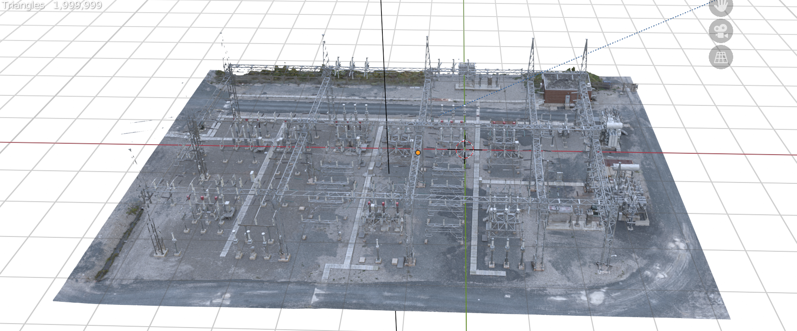
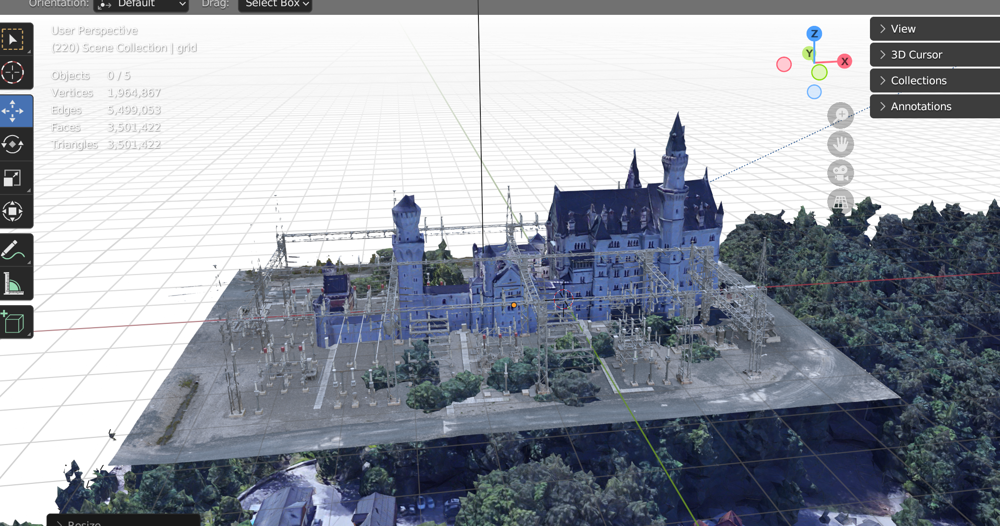
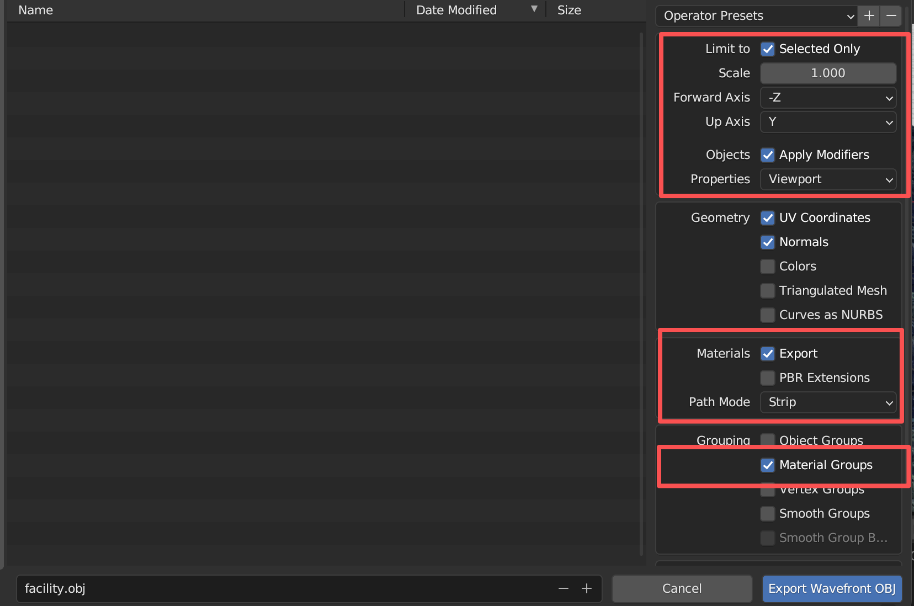
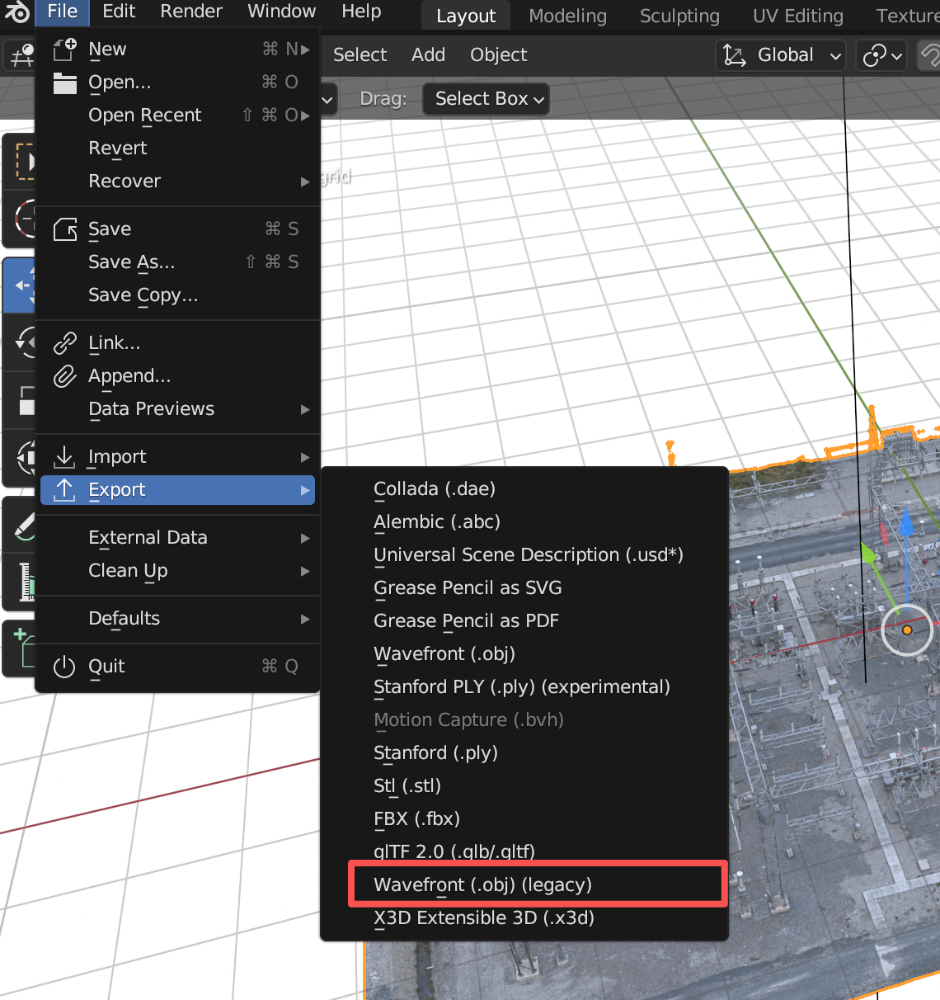
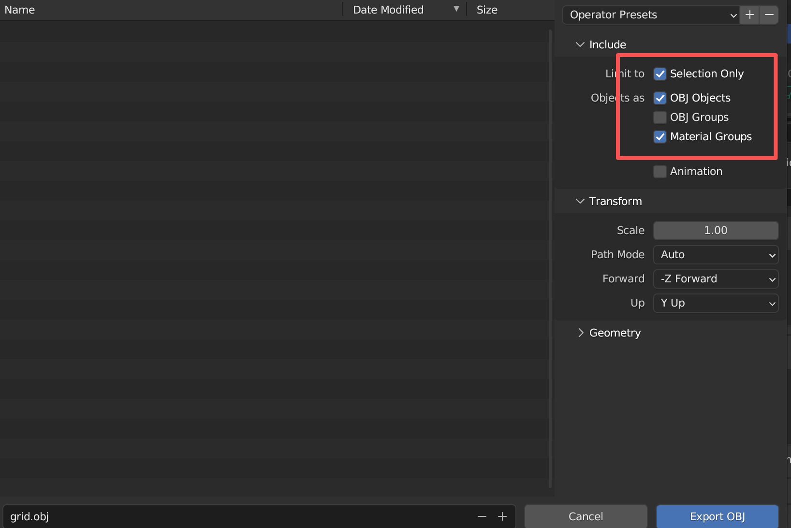

<div align="center">
<h1>MAGICIAN: Efficient Long-Term Planning with Imagined Gaussians for Active Mapping</h1>

[Shiyao Li](https://shiyao-li.github.io/), [Antoine Guédon](https://anttwo.github.io/), [Shizhe Chen](https://cshizhe.github.io/), [Vincent Lepetit](https://vincentlepetit.github.io/)

<a href="https://arxiv.org/abs/2603.22650" style="margin-right: 10px;">
  
</a>
<a href="https://shiyao-li.github.io/magician/"></a>

<br>


</div>

## Getting Started

### 1. Clone the Repository

```bash
git clone --recursive git@github.com:shiyao-li/MAGICIAN.git
cd MAGICIAN
```

### 2. Environment Setup

```bash

conda env create -f environment.yml
conda activate magician
# install pytorch-3d
pip install "git+https://github.com/facebookresearch/pytorch3d.git"

cd RaDe-GS
pip install -r requirements.txt
pip install submodules/diff-gaussian-rasterization --no-build-isolation
pip install submodules/simple-knn/ --no-build-isolation

# tetra-nerf for Marching Tetrahedra
cd submodules/tetra_triangulation
cmake .
# you can specify your own cuda path
# export CPATH=/usr/local/cuda/include:$CPATH
make 
pip install -e .
cd ../../..
```

### 3. Dataset

Download the dataset [here](https://huggingface.co/datasets/sli016/Macarons-plus-plus/tree/main) and place it under a `data/` folder in the project root.

### 4. Pretrained Weights

Download the pretrained model weights from [Google Drive](https://drive.google.com/drive/folders/1wyc9_QFmcxOz4oerE8kCQ3I8LO5zioZL) and place them under a `weights/` folder in the project root.

### 5. Run

```bash
python test_magician_planning.py
```

### 6. Configuration

Key parameters are in `configs/test/test_in_default_scenes_config.json`:

| Parameter | Description |
|-----------|-------------|
| `beam_width` | Beam search: number of candidates kept at each step |
| `beam_steps` | Beam search: lookahead depth (number of steps) |
| `lmdb_dir_name` | Name of the output LMDB directory under `results/scene_exploration/` |

### 7. Evaluate Metrics

```bash
python evaluation_lmdb.py
```

The LMDB file (specified by `lmdb_dir_name`) stores the following data for each trajectory:

- **Coverage update history**: how coverage evolves step by step
- **Camera poses**: the full history of visited camera positions
- **Final point cloud**: the reconstructed point cloud at the end of the trajectory

## Exploring Arbitrary 3D Scenes

<details>
<summary><b>Click to expand: how to run MAGICIAN on your own scene</b></summary>

MAGICIAN can explore any custom 3D scene provided as a `.obj` file (e.g., downloaded from [Sketchfab](https://sketchfab.com/)). The key preparation step is to import the mesh into Blender, scale it to roughly match the spatial scale of the provided scenes, and re-export it.

### Step 1 — Use a provided scene as a scale reference

Open one of the provided scenes in Blender to get a sense of the target scale. For example, here is the **Neuschwanstein** scene from our dataset:



### Step 2 — Import your target scene

In Blender, go to **File > Import > Wavefront (.obj)** to import the `.obj` file of the scene you want MAGICIAN to explore. For example, below is a **power facility** scene:



### Step 3 — Align the scale

In Blender, scale, rotate, and/or translate your scene so that its bounding box roughly matches the reference scene. This does not need to be precise — we find that MAGICIAN generalizes well across a wide range of scene scales.



### Step 4 — Select the scene and configure export settings

Select your scene object and review the settings before exporting:



### Step 5 — Export as `.obj`

Go to **File > Export > Wavefront (.obj)** and follow the steps shown below:





This produces a `.obj` file, a `.mtl` file, and any associated texture files. The `.obj` and `.mtl` files must share the same base name.

### Step 6 — Configure `settings.json` and add the scene to the dataset

1. Create a new directory for your scene under `./data/Macarons++/`, e.g. `./data/Macarons++/power_facility/`.
2. Move the `.obj`, `.mtl`, and texture files into that directory.
3. Copy the `settings.json` from a reference scene (e.g., `neuschwanstein`) into your scene directory and edit it to match your scene. A typical file looks like this:

```json
{
  "scene": {
    "grid_l": 5, "grid_w": 3, "grid_h": 5,
    "cell_capacity": 1000, "cell_resolution": 0.05,
    "x_min": [-10.05, -0.36, -3.27],
    "x_max": [9.48, 3.15, 3.58],
    "visibility_ratio": 0.99
  },
  "camera": {
    "pose_l": 15, "pose_w": 5, "pose_h": 8,
    "pose_n_theta": 5, "pose_n_azim": 10,
    "x_min": [-10.0, 0.0, -3.0],
    "x_max": [10.0, 4.0, 3.0],
    "start_positions": [[0,3,4,1,8],[11,2,1,1,4],[9,2,5,0,4],[1,1,3,4,5],[7,0,5,2,0]],
    "contrast_factor": 1.2
  }
}
```

Here is what each parameter means:

**Scene grid** (`scene` block):
- `x_min`, `x_max` — the bounding box of the region you want MAGICIAN to explore, in 3D world coordinates. Set these to tightly enclose your scene after scaling.
- `grid_l`, `grid_w`, `grid_h` — number of grid cells along each axis. MAGICIAN divides the scene into this coarse voxel grid to track which regions have been reconstructed. Aim for roughly cubic cells (i.e. match the proportions of your bounding box).
- `cell_capacity`, `cell_resolution` — maximum number of points per cell and the spatial resolution at which surface points are registered.
- `visibility_ratio` — fraction of all candidate camera poses from which a surface point must be visible to be considered fully covered. This is computed from your scene geometry and can typically be left close to `1.0`.

**Camera action space** (`camera` block):
- `x_min`, `x_max` — the bounding box within which the camera is allowed to move.
- `pose_l`, `pose_w`, `pose_h` — number of candidate camera positions along each axis, defining the discrete position grid.
- `pose_n_theta`, `pose_n_azim` — number of discrete elevation angles and azimuth angles available at each position, defining the camera orientation grid.
- `start_positions` — a list of 5 randomly sampled starting poses (each encoded as a 5D grid index `[l, w, h, theta, azim]`), used to initialise independent exploration trajectories.
- `contrast_factor` — a rendering contrast factor applied to captured images.

4. Also copy `occupied_pose.pt` from a reference scene as a starting point.
5. Add your scene name to `test_scenes` in `configs/test/test_in_default_scenes_config.json`:
   ```json
   "test_scenes": ["neuschwanstein", ..., "power_facility"]
   ```
6. Run MAGICIAN as usual:
   ```bash
   python test_magician_planning.py
   ```

</details>

## Citation

```bibtex
@inproceedings{li2026magician,
  author = "Shiyao Li and Antoine Guédon and Shizhe Chen and Vincent Lepetit",
  title = {{MAGICIAN: Efficient Long-Term Planning with Imagined Gaussians for Active Mapping}},
  booktitle = {{Proceedings of the IEEE Conference on Computer Vision and Pattern Recognition (CVPR)}},
  year = 2026
}
```